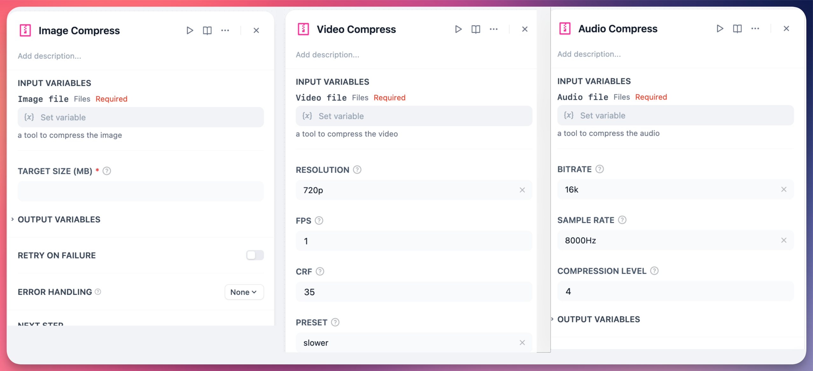
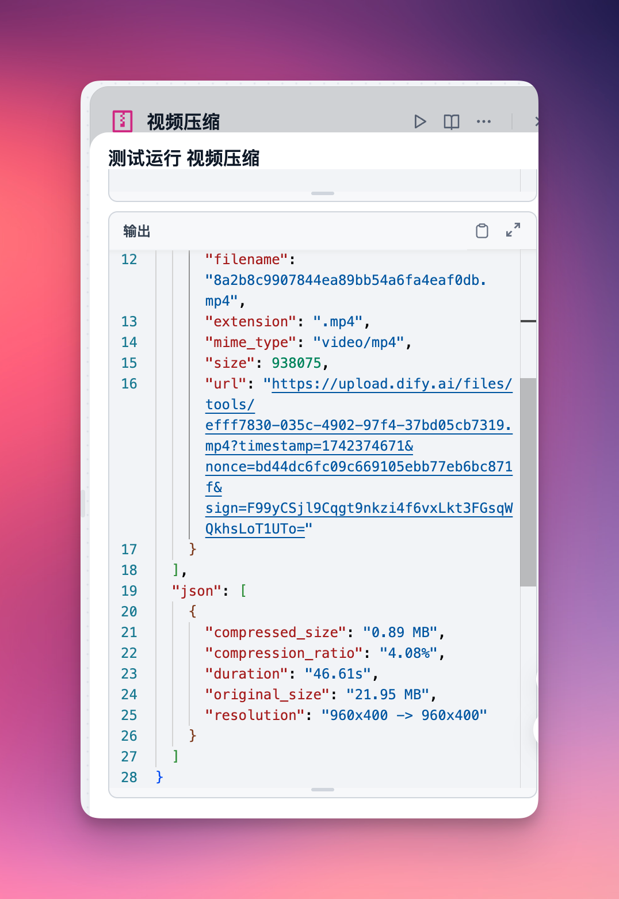

# compress

A tool to compress Image/Audio/Video files.

When sending a video to the LLM, it extracts the key frames. So, why not compress the video beforehand? This would significantly lower both token and transfer costs.

This tool utilizes Pillow to compress image quality, effectively reducing image size. Additionally, it employs FFmpeg to adjust parameters, minimizing the size of video and audio files.

The video has been compressed to just 1/20 of its original size.

